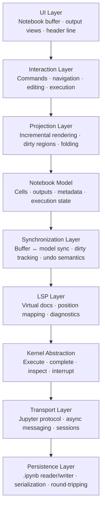
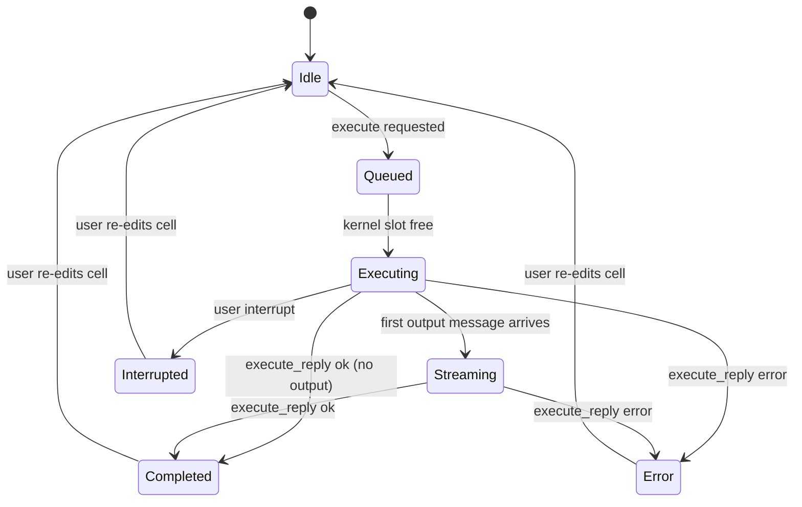
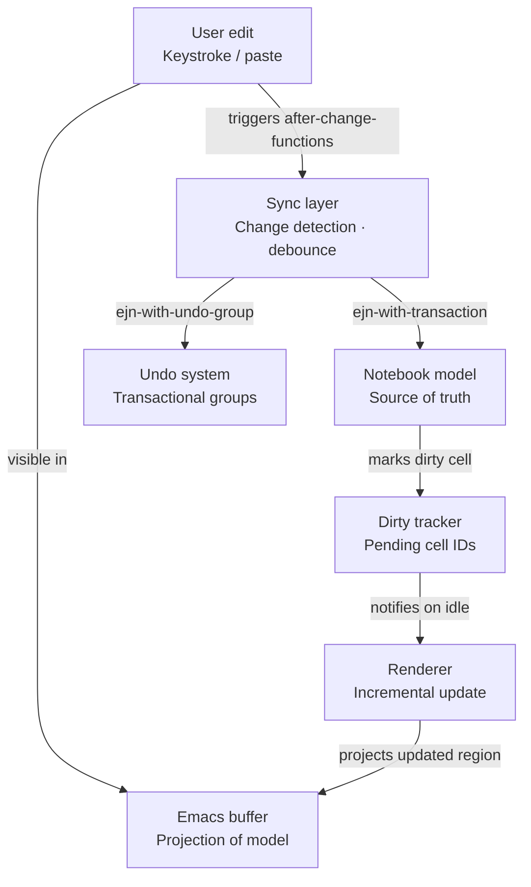

# EJN Phase 0 — Diagrams (Text Format)

---

## 1. Architecture Layers

Top-down layered architecture. Each layer may only communicate with adjacent layers.

```
┌─────────────────────────────────────────────────────┐
│                     UI LAYER                        │
│         Notebook buffer · output views              │
│                   header line                       │
├─────────────────────────────────────────────────────┤
│                INTERACTION LAYER                    │
│        Commands · navigation · editing              │
│                    execution                        │
├─────────────────────────────────────────────────────┤
│                 PROJECTION LAYER                    │
│      Incremental rendering · dirty regions          │
│                    folding                          │
├─────────────────────────────────────────────────────┤
│                 NOTEBOOK MODEL                      │
│         Cells · outputs · metadata                  │
│               execution state                       │
├─────────────────────────────────────────────────────┤
│              SYNCHRONIZATION LAYER                  │
│    Buffer ↔ model sync · dirty tracking             │
│                undo semantics                       │
├─────────────────────────────────────────────────────┤
│                   LSP LAYER                         │
│      Virtual docs · position mapping                │
│                  diagnostics                        │
├─────────────────────────────────────────────────────┤
│              KERNEL ABSTRACTION                     │
│         Execute · complete · inspect                │
│                   interrupt                         │
├─────────────────────────────────────────────────────┤
│                TRANSPORT LAYER                      │
│    Jupyter protocol · async messaging               │
│                   sessions                          │
├─────────────────────────────────────────────────────┤
│               PERSISTENCE LAYER                     │
│       .ipynb reader/writer · serialization          │
│                round-tripping                       │
└─────────────────────────────────────────────────────┘
```

Or as a Mermaid flowchart:



**Layer groupings by concern:**

| Group | Layers |
|---|---|
| UI / interaction | UI layer, Interaction layer |
| Model / rendering | Projection layer, Notebook model |
| Synchronization | Synchronization layer |
| Language intelligence | LSP layer |
| Kernel / transport | Kernel abstraction, Transport layer |
| Storage | Persistence layer |

---

## 2. Cell Execution State Machine



**State descriptions:**

| State | Description | Editable? |
|---|---|---|
| `idle` | Default state. Source is editable, no pending execution. | Yes |
| `queued` | Execution request submitted; waiting for kernel to become available. | No |
| `executing` | Kernel is actively running the cell's code. | No |
| `streaming` | Kernel is executing and output messages are arriving incrementally. | No |
| `completed` | Execution finished successfully. `execution-count` is set. | Yes |
| `error` | Execution finished with an error. Traceback stored in outputs. | Yes |
| `interrupted` | User interrupted the running execution. Kernel notified. | Yes |

**Transition triggers:**

| From | To | Trigger |
|---|---|---|
| `idle` | `queued` | `ejn-execute-cell` called |
| `queued` | `executing` | Kernel sends `execute_input` message |
| `executing` | `streaming` | Any `stream`, `display_data`, or `execute_result` message arrives |
| `executing` | `completed` | `execute_reply` with `status: ok` (no prior output) |
| `executing` | `error` | `execute_reply` with `status: error` |
| `executing` | `interrupted` | `ejn-kernel-interrupt` acknowledged |
| `streaming` | `completed` | `execute_reply` with `status: ok` |
| `streaming` | `error` | `execute_reply` with `status: error` |
| `completed` / `error` / `interrupted` | `idle` | User edits cell source |

---

## 3. Synchronization Flow



**Data flow in plain text:**

```
1. User types in notebook buffer
       │
       ▼
2. after-change-functions fires → Sync layer detects change
       │
       ├─► identifies affected cell by position
       ├─► extracts new source text from buffer region
       └─► schedules debounced model update (200ms idle)
               │
               ▼
3. Sync layer opens transaction: ejn-with-transaction
       │
       ├─► ejn-cell-set-source   — writes new source to model
       └─► ejn-notebook-mark-dirty — adds cell-id to dirty set
               │
               ▼
4. Dirty tracker holds set of changed cell-ids
               │
               ▼
5. Renderer reads dirty set on next redisplay
       │
       ├─► redraws only affected cell regions (no full-buffer redraw)
       └─► clears dirty set after render
               │
               ▼
6. Buffer now reflects updated model state (projection)
```

**Ownership rules:**

| Rule | Detail |
|---|---|
| Buffer is read-only for state | Buffer text is never treated as the notebook source. It is a rendered projection. |
| Model mutations go through sync | No subsystem calls model mutation functions directly; all writes use `ejn-with-transaction`. |
| Kernel callbacks don't touch buffers | Output arrives at the output router → model update → re-render. Never directly to the buffer. |
| Undo is model-level | Buffer undo entries inside a managed transaction are suppressed. `ejn-with-undo-group` is the canonical undo record. |
